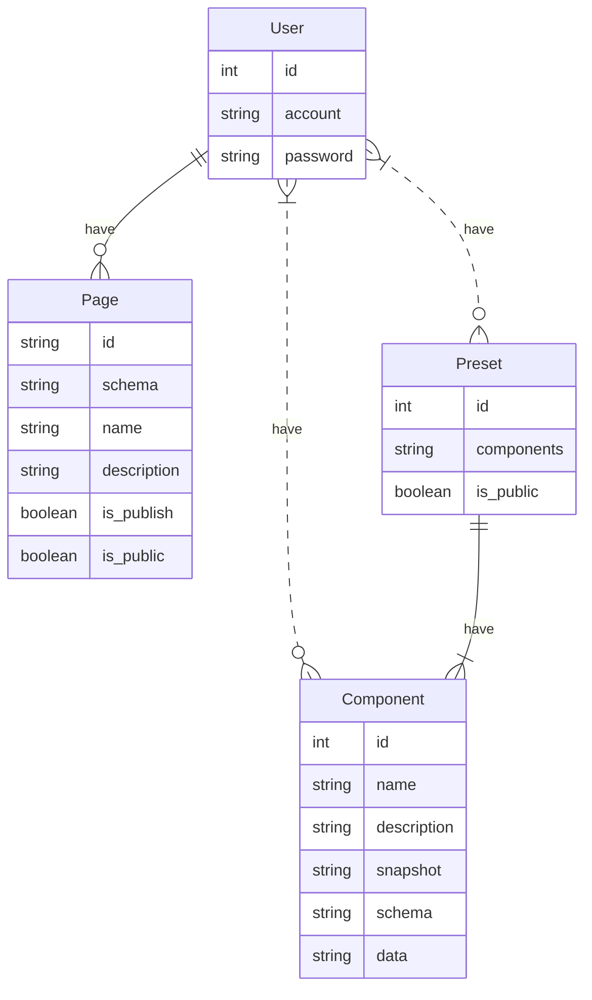

# YU PAGE Server

## 数据库设计

```mermaid
erDiagram
  User {
    int id
    string account
    string password
  }
  Page {
    string id
    string schema
    string name
    string description
    boolean is_publish
    boolean is_public
  }
  Preset {
    int id
    string components
    boolean is_public
  }
  Component {
    int id
    string name
    string description
    string snapshot
    string schema
    string data
  }
  User ||--o{ Page : have
  User }|..o{ Preset : have
  User }|..o{ Component : have
  Preset ||--|{ Component : have
```

### 字段释义

`Page.schema` 存储整个页面的结构和数据的 JSON 字符串

`Preset.components` 存储组件 ID，预设的组件数据使用默认数据
